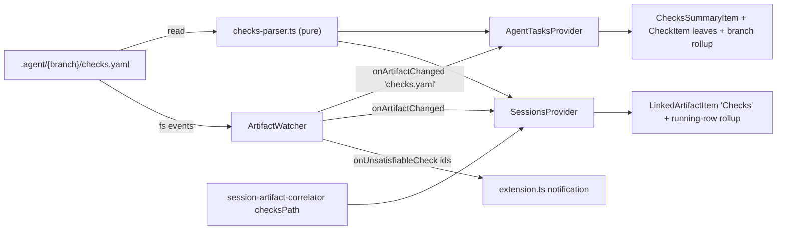

# Plan: Surface `checks.yaml` in the vscode-agent-tasks extension

## TL;DR

The `aw-planner` (autonomous-workflow v3.15) now emits `.agent/{branch}/checks.yaml` — an executable acceptance-check ledger whose `status:` fields the executor flips live during Phase 4 — and the VS Code extension currently ignores it entirely.
This plan adds read-only support: a new pure `checks-parser`, a `Checks` node with per-check status icons under each branch in the Agent Tasks panel, `✓ n/m` progress rollups on branch rows and running-session rows, Sessions-panel correlation, live watcher refresh on both native and Linux watcher paths, and a one-time warning notification when a check transitions to `unsatisfiable` (the executor's escalation affordance).
The extension never mutates the file — check definitions are executor-immutable and `status:` is executor-owned, so the extension is strictly an observer.
Done when: a Full-tier `aw` run shows its checks ticking from pending to pass live in the sidebar, all new unit tests pass, and `nx build && nx test && nx lint vscode-agent-tasks` is green.

## Requirements

1. The extension shall parse and display `.agent/{branch}/checks.yaml` (per-check id + status) in the Agent Tasks panel as a collapsible `Checks` node under the branch, with one leaf per check. — [user-stated]
2. Creation, modification, and deletion of `checks.yaml` shall live-refresh both trees, on both the native (macOS/Windows) watcher path and the VS Code fallback (Linux) watcher path. — [inferred]
3. When checks exist, a compact `✓ {pass}/{total}` rollup shall appear in the branch row description and on running-session rows. — [inferred]
4. The Sessions panel shall correlate a session to its `checks.yaml` (new `checksPath` in `LinkedArtifacts`), showing a `Checks` child item and listing it in the session tooltip. — [inferred]
5. When a check transitions to `unsatisfiable`, the extension shall fire exactly one warning notification per check id per file, with an action button that opens `checks.yaml`; suppressible via a new `agentTasks.notifyUnsatisfiableCheck` setting (default `true`). — [inferred]
6. The surface is read-only: no mutation affordances (no "mark as pass"), and `checks.yaml` is excluded from standalone `deleteArtifacts` (same reasoning as `plan.md` — deleting it silently downgrades the executor to judgment-gating). — [inferred]
7. Absence is backward compatible: no `checks.yaml` (Micro/Lite/fix-bug fast-lane/legacy branches) means no node, no rollup, and zero behavior change. — [inferred]
8. The `Checks` row supports `revealInOS` and `copyPath` context actions, and clicking it opens the YAML as a plain text document — never through the Markdown preview path. — [inferred]
9. New logic follows repo test conventions: pure parser tested with in-memory strings, correlator tested with real temp dirs, no VS Code imports in testable modules. — [inferred]

### Out of Scope

1. A webview or custom editor for `checks.yaml` — click-to-open-as-text is sufficient for v1.
2. Any write path (flipping statuses, editing checks from the tree) — violates the executor-immutable contract.
3. `agentTasks.autoOpenChecks` auto-open behavior — `checks.yaml` arrives together with `plan.md`, and one auto-open per plan event is enough.
4. Editor gutter decorations / CodeLens inside the opened YAML — deferred until the tree UX proves out.
5. Surfacing branch dirs that contain ONLY `checks.yaml` — `aw-create-plan` always writes it alongside `plan.md`, so the `findBranchDirs` predicate stays unchanged.

## Decisions

| Decision | Alternatives Rejected | Rationale |
| -------- | --------------------- | --------- |
| Hand-roll a tolerant line-based parser in a new `src/parsers/checks-parser.ts` | (a) add the `yaml` npm package as a runtime dependency; (b) reuse `parseFrontmatter` from `markdown-parser.ts` | The file is machine-emitted by `aw-create-plan` with a fixed, flat schema (list of flat maps, known keys); `parseFrontmatter` is a single-level `key: value` splitter that cannot handle list entries; a real YAML dependency adds bundle weight for a schema that never nests (the package currently ships only `tslib`, and `yaml`/`js-yaml` exist in the lockfile solely as transitive nx/vite tooling deps that esbuild would not otherwise bundle). Hand-rolled parsers are the established convention in `src/parsers/`. |
| New parser module rather than extending `markdown-parser.ts` | Adding `parseChecksYaml` to `markdown-parser.ts` | That module's header contract scopes it to Markdown artifacts; a YAML parser in it muddies the module boundary. Same purity rules apply (no VS Code deps, vitest-testable). |
| `ArtifactWatcher` owns unsatisfiable-transition detection and exposes a new `onUnsatisfiableCheck` event; `extension.ts` subscribes and shows the notification | (a) detect in each provider during tree build; (b) a separate standalone watcher class | The watcher is already the single owner of file-level artifact events (auto-open lives there); providers stay display-only; a per-path `Map` of previously-seen statuses plus a pure `diffNewUnsatisfiable` helper keeps the logic vitest-testable. Detecting in providers would double-fire (two providers parse the same file) and couple display to notification policy. |
| Rollup on session rows only while the session is `running` | Always appending the rollup to every session row description | `SessionItem.description` is already `branch(≤25) · time` and VS Code clips long descriptions on narrow panels (documented gotcha); while running is exactly when the "how far along" signal has value. Branch rows in Agent Tasks always show it (they have more room). |
| Notify only on the `pending/fail/pass → unsatisfiable` transition; `fail` is silent | Notifying on `fail`; notifying on every unsatisfiable refresh | `fail` is a normal intermediate state of the executor's check loop (checks start failing and get fixed) — notifying would be pure noise. `unsatisfiable` is the contract's abort affordance: the executor is blocked and escalating, which is the one genuinely actionable moment. Per-id dedup prevents re-notify on every watcher tick. A full statuses reset to `pending` (plan re-iteration re-derives the file) simply clears the per-path map — it is not a regression and produces no notification. |
| New contextValue `agentChecksFile` added to `revealInOS`/`copyPath` menu regexes but NOT to `deleteArtifacts` | Making it deletable with warning copy | Mirrors the existing `plan.md` precedent — it is deliberately not deletable in isolation because deleting it silently changes executor behavior (downgrade to judgment-gating). Branch-level delete still wipes the whole dir, which is the intended cleanup path. |
| Fix the Markdown-preview mismatch inside the existing `agentTasks.openMarkdown` command (route non-`.md` paths to `openTextDocument`) | A new dedicated `agentTasks.openFile` command | `LinkedArtifactItem` (Sessions) and the new checks items share the opener; special-casing by extension in one place fixes both panels and the watcher's `openArtifact` without new command surface in `package.json`. |
| Unknown/missing `status:` values normalize to `pending` | Failing the parse; introducing an `unknown` status | The parser must be tolerant (the file is agent-edited); `pending` is the safe visual default and keeps the `CheckStatus` union closed to the four contract states. |

## Technical Approach

Data flows one way — file → parser → (correlator, watcher, providers) → tree items / notification:



Integration points (from the code survey, current line numbers):

- `agent-tasks-provider.ts` (1035 lines): branch children are built in `getBranchChildren` (~L923–992; plan pushed ~L974, walkthrough ~L978, diagnose ~L987) — insert the `Checks` node after Plan. `AgentBranchItem` (L180) gains a parsed-checks field populated in `collectBranchesForWorktree` (~L617 where `task.md`/`plan.md`/`walkthrough.md` are read). `getBranchIcon` (L150) / `getBranchDescription` (L165) gain an optional `ChecksSummary` param, threaded through both call sites (`AgentBranchItem` L192/194, `WorktreeFlatItem` L263/266). New items join the `AgentTaskTreeItem` union (L566–580).
- `sessions-provider.ts` (1347 lines): `makeArtifactChildren` (~L1088–1100) gains the `checksPath` branch; `buildTooltip` (~L372–385) lists it; the running-row rollup reads the correlated `checksPath` where `sessionLinks` is populated (`buildRootItems` ~L1174–1193).
- `artifact-watcher.ts` (600 lines): `checks.yaml` added to the native basename dispatch (~L397, alongside `ARTIFACT_FILES` at L28) and to the Linux fallback `patterns` array (L436–442). The `onArtifactChanged` payload is an ignored string, so emitting `'checks.yaml'` needs no consumer changes. Transition detection: on each checks event, read + parse, diff against a per-path `Map<string, CheckStatus>`, fire `onUnsatisfiableCheck` with newly-unsatisfiable ids, update the map; drop the map entry on file delete.
- `extension.ts` (973 lines): `resolveTarget` (L153–189) gains the checks item branch; `agentTasks.openMarkdown` (L96–108) routes non-`.md` to `vscode.window.showTextDocument`; the unsatisfiable notification subscription follows the one-time gh-missing precedent (L277–283) but dedups per check id (the watcher's diff already guarantees transition-only firing).

### Patterns to Follow

- Parser purity: `src/parsers/session-jsonl-parser.ts` and `parseDiagnoseMd` in `markdown-parser.ts` (L495) — tolerant, returns safe defaults, zero VS Code imports.
- Temp-dir tests for fs-touching helpers: `src/lib/session-artifact-correlator.test.ts` (ESM vitest cannot `vi.spyOn(fs)` — documented gotcha).
- Child summary items: `DiagnoseSummaryItem` (L489) and `PlanVersionsGroupItem` (L428) are the precedents for `ChecksSummaryItem` (collapsible group) + `CheckItem` (leaf).
- Menu wiring: the three `view/item/context` when-clause regexes in `package.json` (~L329/L334/L339) enumerate contextValues explicitly.
- TreeItem descriptions stay short (`✓ 3/7`, not sentences) — VS Code clips them.

### Edge Cases

| Edge Case | Handling |
| --------- | -------- |
| Quoted `run:`/`ears:` values containing colons (e.g. `run: "curl -s localhost:3000"`) | Parser splits on the FIRST `: ` after the known key name only; surrounding single/double quotes stripped; covered by a dedicated unit test |
| Unknown `status:` value or missing `status:` line | Normalize to `pending` (tolerant parse, closed union) |
| Malformed file (no `- id:` entries, binary garbage, empty) | `parseChecksYaml` returns `{ checks: [] }`; providers render nothing (same as absent file) |
| Plan re-iteration resets all statuses to `pending` | Watcher map is replaced wholesale; no transition to `unsatisfiable` occurs, so no notification; tree simply re-renders all-pending |
| `checks.yaml` deleted (branch cleanup) | Watcher fires; per-path status map entry evicted; node and rollups disappear on refresh |
| Branch names containing `/` (e.g. `claude/foo`) | Already handled — correlator/providers use `path.join(worktree, dir, branchName)` which nests naturally |
| Session not running but checks exist | No rollup on the session row (running-only decision); `Checks` child + tooltip entry still present |

### API / Interfaces

```ts
// src/parsers/checks-parser.ts (new, pure)
export type CheckStatus = 'pending' | 'pass' | 'fail' | 'unsatisfiable';
export interface ParsedCheck {
  id: string;              // "AC-1"
  requirement?: string;    // "R1"
  ears?: string;           // EARS criterion text (leaf description/tooltip)
  kind?: 'command' | 'grep' | 'judge';
  expect?: string;
  status: CheckStatus;     // unknown/missing → 'pending'
}
export interface ParsedChecks { checks: ParsedCheck[] }
export interface ChecksSummary { total: number; pass: number; fail: number; unsatisfiable: number; pending: number }
export function parseChecksYaml(content: string): ParsedChecks;
export function summarizeChecks(checks: ParsedCheck[]): ChecksSummary;
export function formatChecksRollup(s: ChecksSummary): string; // "✓ 3/7"; "" when total === 0
export function diffNewUnsatisfiable(prev: ReadonlyMap<string, CheckStatus> | undefined, next: ParsedCheck[]): string[];

// src/lib/session-artifact-correlator.ts — LinkedArtifacts gains:
checksPath?: string;

// src/watchers/artifact-watcher.ts — new event:
readonly onUnsatisfiableCheck: vscode.Event<{ checksPath: string; ids: string[] }>;

// package.json — new setting:
"agentTasks.notifyUnsatisfiableCheck": { "type": "boolean", "default": true }
```

Status → icon mapping for `CheckItem`: `pending` → `circle-large-outline`, `pass` → `pass` (testing.iconPassed green), `fail` → `error` (testing.iconFailed red), `unsatisfiable` → `warning` (yellow).

## Acceptance Criteria

- [ ] AC-1 (covers: R1) — When `parseChecksYaml` receives a `checks.yaml` body in the documented schema (including quoted values containing colons, comments, and an entry with a missing or unknown `status:`), it shall return one `ParsedCheck` per `- id:` entry with correct `id`, `kind`, `ears`, and normalized `status`, and `{ checks: [] }` for empty or malformed input.
- [ ] AC-2 (covers: R1) — When a branch's artifact dir contains `checks.yaml` with ≥ 1 check, the Agent Tasks branch node shall include a collapsible `ChecksSummaryItem` (contextValue `agentChecksFile`) with one `CheckItem` leaf per check, each carrying the status icon mapping.
- [ ] AC-3 (covers: R2) — When `checks.yaml` is created, modified, or deleted under a watched artifact dir, `ArtifactWatcher` shall emit `onArtifactChanged` on both the native basename-dispatch path and the VS Code fallback pattern path (Linux), so both providers refresh.
- [ ] AC-4 (covers: R3) — When `summarizeChecks` reports `total > 0`, `formatChecksRollup` shall return `✓ {pass}/{total}` and the string shall be appended to the branch row description (both `AgentBranchItem` and `WorktreeFlatItem` call sites) and to `running` session rows; when `total === 0` it shall return `""` and no rollup appears.
- [ ] AC-5 (covers: R4) — When `checks.yaml` exists in the correlated `(worktree, branch)` artifact dir, `findLinkedArtifacts` shall return `checksPath` and the session shall show a `Checks` child item; when absent, `checksPath` is undefined.
- [ ] AC-6 (covers: R5) — When a check id's status changes to `unsatisfiable` from any other state, `diffNewUnsatisfiable` shall return that id exactly once for the transition, and the extension shall show one warning notification with an open-file action, suppressed when `agentTasks.notifyUnsatisfiableCheck` is `false`; a wholesale reset to `pending` shall produce no ids.
- [ ] AC-7 (covers: R6, R8) — The `agentChecksFile` contextValue shall appear in the `revealInOS` and `copyPath` `view/item/context` when-clause regexes in `package.json` and shall NOT appear in the `deleteArtifacts` regex.
- [ ] AC-8 (covers: R7) — When no `checks.yaml` exists in a branch dir, the tree output and `LinkedArtifacts` shall be byte-identical to current behavior (no node, no rollup, no new fields set) and the full pre-existing test suite shall still pass.
- [ ] AC-9 (covers: R8) — When a checks item is opened (either panel), the file shall open via a text-document path, never via `markdown.showPreview`, regardless of `agentTasks.openMarkdownInPreview`.
- [ ] AC-10 (covers: R9) — When the implementation is complete, `nx build vscode-agent-tasks`, `nx test vscode-agent-tasks`, and `nx lint vscode-agent-tasks` shall all exit 0, with the new parser tested via in-memory strings and the correlator via real temp dirs.

## Implementation Order

1. Create `src/parsers/checks-parser.ts` (types + `parseChecksYaml` + `summarizeChecks` + `formatChecksRollup` + `diffNewUnsatisfiable`) and `src/parsers/checks-parser.test.ts` — pure slice, no integration yet.
2. Add `checksPath` to `LinkedArtifacts` in `src/lib/session-artifact-correlator.ts` (interface, detection, `artifactDir` gate, `hasLinkedArtifacts`) and extend `session-artifact-correlator.test.ts` with present/absent temp-dir cases.
3. Wire `ArtifactWatcher`: add `checks.yaml` to the native dispatch and the Linux `patterns` array; add the per-path status map, parse-on-event, `diffNewUnsatisfiable` call, `onUnsatisfiableCheck` event, and delete-eviction.
4. Agent Tasks panel: add `ChecksSummaryItem` + `CheckItem` classes, extend the `AgentTaskTreeItem` union, read/parse checks in `collectBranchesForWorktree`, push the node in `getBranchChildren`, thread `ChecksSummary` through `getBranchIcon`/`getBranchDescription` and both call sites.
5. Sessions panel: `Checks` child in `makeArtifactChildren`, tooltip line in `buildTooltip`, running-row rollup where `sessionLinks` is built.
6. `extension.ts`: `resolveTarget` branch for the checks item; non-`.md` routing in `agentTasks.openMarkdown`; `onUnsatisfiableCheck` subscription + warning notification gated on the new setting.
7. `package.json`: `agentTasks.notifyUnsatisfiableCheck` setting; `agentChecksFile` in the `revealInOS`/`copyPath` menu regexes; update the extension `description` and `agentTasks.directories` description strings that enumerate artifact names.
8. Docs: update `packages/vscode-agent-tasks/CLAUDE.md` (key concepts, config namespace, gotchas) and the root `CLAUDE.md` extension section.
9. Full verification pass (build + test + lint) and manual smoke against a fixture `.agent/<branch>/checks.yaml`.

## File Changes

| Action | File | Change | Reason |
| ------ | ---- | ------ | ------ |
| create | packages/vscode-agent-tasks/src/parsers/checks-parser.ts | Pure tolerant parser + summary/rollup/diff helpers (see API section) | New artifact type needs a parser; markdown-parser is scoped to Markdown |
| create | packages/vscode-agent-tasks/src/parsers/checks-parser.test.ts | Unit tests: schema parse, quoted colons, unknown status, empty/malformed, rollup formatting, unsatisfiable diff + reset case | AC-1, AC-4, AC-6; repo test conventions |
| modify | packages/vscode-agent-tasks/src/lib/session-artifact-correlator.ts | `checksPath?` field, detection + gate + `hasLinkedArtifacts` | AC-5; Sessions correlation |
| modify | packages/vscode-agent-tasks/src/lib/session-artifact-correlator.test.ts | Temp-dir cases: checks present / absent / checks-only dir | AC-5, AC-8 |
| modify | packages/vscode-agent-tasks/src/watchers/artifact-watcher.ts | Watch `checks.yaml` (native + Linux patterns); status map + `onUnsatisfiableCheck` event; delete eviction | AC-3, AC-6; live refresh + escalation source |
| modify | packages/vscode-agent-tasks/src/providers/agent-tasks-provider.ts | `ChecksSummaryItem` + `CheckItem` + union entry; parse in `collectBranchesForWorktree`; push in `getBranchChildren`; rollup threading through icon/description free functions | AC-2, AC-4; primary display surface |
| modify | packages/vscode-agent-tasks/src/providers/sessions-provider.ts | `Checks` child in `makeArtifactChildren`; tooltip entry; running-row rollup | AC-4, AC-5 |
| modify | packages/vscode-agent-tasks/src/extension.ts | `resolveTarget` checks branch; non-`.md` open routing; unsatisfiable notification subscription | AC-6, AC-7, AC-9 |
| modify | packages/vscode-agent-tasks/package.json | `agentTasks.notifyUnsatisfiableCheck` setting; `agentChecksFile` in revealInOS/copyPath regexes (NOT deleteArtifacts); description strings | AC-6, AC-7 |
| modify | packages/vscode-agent-tasks/CLAUDE.md | Document checks support (key concepts, settings, gotchas) | Phase 5 doc contract |
| modify | CLAUDE.md | Update the vscode-agent-tasks key-source-files/status section with the checks surface | Root inventory stays accurate |

## Existing Code Survey

| Planned new unit | Searched for | Closest existing match | Verdict | Rationale |
| ---------------- | ------------ | ---------------------- | ------- | --------- |
| `checks-parser.ts` (`parseChecksYaml`) | `grep -rn "yaml" packages/vscode-agent-tasks/src package.json` (no runtime YAML dep; only transitive nx/vite lockfile entries); read `markdown-parser.ts` `parseFrontmatter` L73–91 (single-level `key: value` splitter, cannot parse list entries); `parseDiagnoseMd` L495 (Markdown-only) | `parseFrontmatter` in `src/parsers/markdown-parser.ts` — not YAML-capable | BUILD NEW | No existing unit parses YAML lists; extending `parseFrontmatter` would break its frontmatter contract; a dependency is rejected in Decisions. Follows `parseDiagnoseMd`'s tolerance pattern |
| `ChecksSummaryItem` / `CheckItem` tree items | Read `agent-tasks-provider.ts` item classes L80–580 (`DiagnoseSummaryItem`, `PlanVersionsGroupItem`, `PlanVersionItem`) | `DiagnoseSummaryItem` (L489) — per-artifact summary leaf | BUILD NEW | Each artifact type has its own TreeItem class by established convention; Diagnose/PlanVersions are the structural template but represent different artifacts with different children semantics |
| `diffNewUnsatisfiable` transition helper | `grep -rn "no-flip\|previous\|transition" packages/vscode-agent-tasks/src/lib` — `pr-status-cache.ts` no-flip guarantee; `claimPendingAdoption` in `process-tree.ts` | `PrStatusCache` no-flip logic — PR-status-specific, embedded in cache class | BUILD NEW | The no-flip guarantee solves a different problem (never downgrade merged); a 10-line pure map-diff is not extractable from it; new helper lives beside the parser for testability |

## Tests

| Type | Test Case | File | Validates |
| ---- | --------- | ---- | --------- |
| unit | Full documented schema parses: 3 entries → ids AC-1..AC-3, kinds, ears, statuses | checks-parser.test.ts | AC-1 |
| unit | Quoted `run:`/`ears:` values with embedded colons keep full value | checks-parser.test.ts | AC-1 edge case |
| unit | Unknown/missing `status:` normalizes to `pending`; empty + garbage input → `{ checks: [] }` | checks-parser.test.ts | AC-1 |
| unit | `summarizeChecks`/`formatChecksRollup`: mixed statuses → `✓ 2/5`; zero checks → `""` | checks-parser.test.ts | AC-4 |
| unit | `diffNewUnsatisfiable`: fresh unsatisfiable returned once; unchanged unsatisfiable not repeated; reset-to-pending returns `[]` | checks-parser.test.ts | AC-6 |
| unit | Temp dir with `plan.md` + `checks.yaml` → `checksPath` set; without → undefined; checks-only dir → correlator gate behavior asserted | session-artifact-correlator.test.ts | AC-5, AC-8 |
| manual | Fixture `.agent/test-branch/checks.yaml` in a real workspace: node renders, statuses flip on edit, unsatisfiable notification fires once, delete cleans up | — | AC-2, AC-3, AC-6 |

## Verification

- **After editing**: nx build vscode-agent-tasks
- **Before PR**: nx build vscode-agent-tasks && nx test vscode-agent-tasks && nx lint vscode-agent-tasks

## Progress Log

- [2026-07-05T16:27:50Z] Phase 0: Tier detected Full (10+ files, cross-cutting extension surface). Restate-and-diff done; no blocking information gaps. Lessons read skipped — no aw-lessons store present (home or project-shared).
- [2026-07-05T16:27:50Z] Phase 1: Code survey completed via parallel research (line-level integration points for all 6 touched modules). Companions code-quality(plan) and holistic-analysis applied inline from repo source — not installed in harness.
- [2026-07-05T16:27:50Z] Phase 1: plan.v1.md created — initial
- [2026-07-05T16:27:50Z] Phase 2: Worktree step adapted — remote session already isolated on designated branch claude/vscode-aw-planner-checks-mvslp5; artifacts written in-checkout. checks.yaml derived (10 checks).
- [2026-07-05T16:36:00Z] Phase 3: Implementation complete — 2 files created, 7 modified per File Changes table.
- [2026-07-05T16:36:00Z] Phase 4: Executable Checks Loop — 10/10 checks pass (AC-1..AC-10 flipped to pass). Full gates green: nx build + 268 vitest tests (14 files) + lint. Note: pre-existing tsc --noEmit error in hook-event-watcher.ts:44 confirmed on unmodified baseline via git stash — out of scope, no gate wired to tsc.
