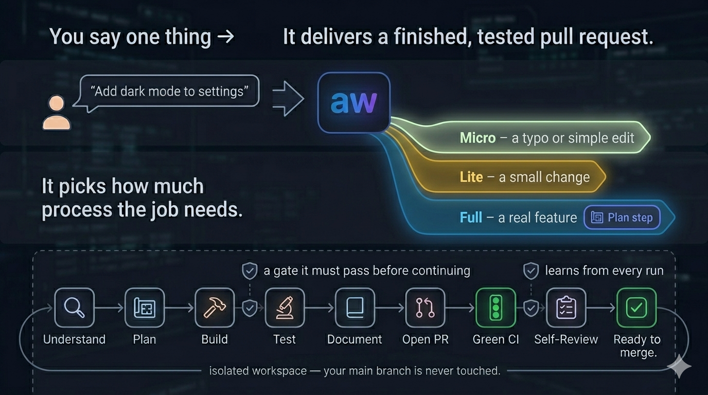

# Agent Skills

> Skills and agents for AI coding assistants — autonomous workflows, code review, TDD, UX, DX, debugging, and more.

[](LICENSE)
[](https://agentskills.io/)
[](#skills-at-a-glance)
[](#agents-at-a-glance)
[](https://claude.com/claude-code)

A curated collection of skills, slash commands, and agents that encode how I actually ship software — distilled from real projects, not theory. They take a holistic approach to building and debugging, with three throughlines:

- **Autonomy** — workflows that carry a task from a one-line prompt to a tested, reviewed PR. The flagship is **`aw`** (the [`autonomous-workflow`](#featured-autonomous-workflow) dispatcher); `fix-bug` is the single-bug counterpart.
- **Product building** — UX, visual design, and analytics treated as first-class, not afterthoughts (`ux`, `visual-design`, `charting`, `rum-tracking`).
- **Quality** — confidence gates, adversarial pre-mortems, and TDD baked into the loop, not bolted on after (`confidence`, `critical`, `tdd`, `code-quality`).

Works with Claude Code, Cursor, Codex, Gemini CLI, Copilot, Windsurf, OpenCode, and any other [Agent Skills](https://agentskills.io)-compatible tool.

```bash
git clone https://github.com/mthines/agent-skills.git
cd agent-skills && bash scripts/sync-symlinks.sh
```

Symlinks every skill live into your tool — edits and `git pull` land on the next agent turn, no reinstall. Upgrading, customizing, and the no-clone `npx` path are in [Install](#install).

---

## Table of contents

- [Skills at a glance](#skills-at-a-glance)
  - [`workflow/` — end-to-end orchestrators](#workflow--end-to-end-orchestrators)
  - [`quality/` — code, tests, plans, AI apps](#quality--code-tests-plans-ai-apps)
  - [`delivery/` — Git, PR, CI](#delivery--git-pr-ci)
  - [`testing/` — E2E and fixture tooling](#testing--e2e-and-fixture-tooling)
  - [`design/` — UI, visual, interaction](#design--ui-visual-interaction)
  - [`analysis/` — investigate data, diagnose issues](#analysis--investigate-data-diagnose-issues)
  - [`authoring/` — skills about Claude Code itself](#authoring--skills-about-claude-code-itself)
- [Agents at a glance](#agents-at-a-glance)
- [Featured: autonomous workflow](#featured-autonomous-workflow)
- [Usage examples](#usage-examples)
- [Install](#install)
  - [Recommended: clone + symlink](#recommended-clone--symlink)
  - [Upgrading](#upgrading)
  - [Customize and still track upstream](#customize-and-still-track-upstream)
  - [Quick try: `npx skills add`](#quick-try-npx-skills-add)
- [VS Code extension](#vs-code-extension)
- [Linear ticket investigator (per-project plug-in)](#linear-ticket-investigator-per-project-plug-in)
- [Repository structure](#repository-structure)
- [Local development](#local-development)
- [Contributing](#contributing)
- [License](#license)

## Skills at a glance

Skills are grouped by directory category. Each row shows the invocation type:

- **`auto`** — model-invokable via `Skill()`. Description sits in your available-skills list every session (~50–150 tokens); body loads only on invocation.
- **`/`** — slash command only. Zero baseline context cost; loads only when you type `/name` or another skill calls it via `Skill()`.
- **`Skill()`** — internal companion. Not user-invocable; only called by another skill.

### `workflow/` — end-to-end orchestrators

Coordinate other skills to ship complete changes.

| Skill | What it does | Type |
|-------|--------------|------|
| **[autonomous-workflow](./skills/workflow/autonomous-workflow/SKILL.md)** | Phase-based orchestrator (0–7): task → plan → worktree → code → test → docs → draft PR → CI gate. Opt-in `aw` dispatcher routes by tier (Micro/Lite single-pass, Full → planner/executor split). Universal two-tier self-improvement: episodic `aw-lessons` promotes to gated `diagnose` at `seen_count ≥ 3`. See [featured section](#featured-autonomous-workflow). | `auto` |
| **[fix-bug](./skills/workflow/fix-bug/SKILL.md)** | 10-phase bug pipeline: intake → triage → evidence → repro-lock → analyse → gate → handoff → verify → telemetry. Lane-split: fast for simple, standard for complex. Self-improves via `fix-bug-lessons` (read Phase 0.5 / write Phase 5·7·8) + promotion to `diagnose`. | `/` |
| **[batch-linear-tickets](./skills/workflow/batch-linear-tickets/SKILL.md)** | Batch-analyze Linear tickets by dispatching `linear-ticket-investigator` (plus `holistic-analysis` for bug tickets) per ticket, gate user approval, then dispatch planners and executors in parallel. Requires Linear MCP. Self-improves via `batch-lessons` (classification + correlation) and inherits `aw-lessons` via the fan-out. | `/` |
| **[implement-suggestion](./skills/workflow/implement-suggestion/SKILL.md)** | Apply reviewer suggestions across one or more PRs. Reads humans and AI bots (`claude[bot]`, `coderabbit`, `sourcery`), validates each via `/critical` + `/confidence`, applies in the existing branch. `--watch` loops on one PR until reviewers go quiet (max 5 iterations). | `/` |
| **[aw-create-plan](./skills/workflow/aw-create-plan/SKILL.md)** | Generates `.agent/{branch}/plan.md` — the source of truth a new session can resume from. | `Skill()` |
| **[aw-create-walkthrough](./skills/workflow/aw-create-walkthrough/SKILL.md)** | Generates `.agent/{branch}/walkthrough.md` — the PR-delivery summary. | `Skill()` |
| **[aw-review-quality-gate](./skills/workflow/aw-review-quality-gate/SKILL.md)** | Self-check quality gate for review findings: filters noise, dedupes, ranks severity. | `Skill()` |

### `quality/` — code, tests, plans, AI apps

Decide whether something is good before you commit to it.

| Skill | What it does | Type |
|-------|--------------|------|
| **[code-quality](./skills/quality/code-quality/SKILL.md)** | Authors and reviews code for low cognitive complexity, guard clauses, early returns, single-responsibility. Four modes: `plan`, authoring (default), `review` (proposes), `simplify` (review-then-apply mechanical refactors behind `confidence(code) ≥ 90 %`). | `auto` |
| **[confidence](./skills/quality/confidence/SKILL.md)** | Rates confidence that work fully solves the requirement. Modes: `plan`, `code`, `analysis`. Multi-signal gate; deterministic rule checks cap LLM score. | `auto` |
| **[critical](./skills/quality/critical/SKILL.md)** | Adversarial pre-mortem: hostile-persona walk through failure modes, blast radius, rollback, hidden coupling, and a mandatory steelman alternative. Never iterates. | `auto` |
| **[polish](./skills/quality/polish/SKILL.md)** | Re-runnable pre-PR branch quality gate. Thin orchestrator over the `reviewer` agent (auto-fix simple, plan complex) and `code-quality` simplify (apply Class M refactors). Modes: bare → full, `review`, `simplify`, `quick`. Commits each pass separately. `/create-pr` delegates its pre-push step here. | `/` |
| **[tdd](./skills/quality/tdd/SKILL.md)** | Strict RED-GREEN-REFACTOR cycles. Writes one failing test, implements minimal code, refactors. | `auto` |
| **[test-provenance-guard](./skills/quality/test-provenance-guard/SKILL.md)** | Detects tests that pass by construction (re-declare the SUT instead of importing it) via static + mutation checks. Self-heals by extracting inline logic and rewriting the test. | `auto` |
| **[/ai-engineering](./skills/quality/ai-engineering/SKILL.md)** | Reviews LLM/AI application engineering across 13 concerns: prompts, caching, RAG, agents, resilience, memory, evals, safety, observability. | `/` |
| **[/dx](./skills/quality/dx/SKILL.md)** | Reviews CLI tools, shell scripts, and developer tooling against clig.dev, 12 Factor CLI, and Heroku CLI Style Guide. | `/` |
| **[/review-changes](./skills/quality/review-changes/SKILL.md)** | Reviews branch changes or a PR. Dispatches to the [`reviewer`](#agents-at-a-glance) agent. | `/` |

### `delivery/` — Git, PR, CI

Plumbing for shipping code.

| Skill | What it does | Type |
|-------|--------------|------|
| **[/create-pr](./skills/delivery/create-pr/SKILL.md)** | Narrative PR description, push, open PR, watch CI, auto-fix simple failures. Pre-push quality delegated to `polish`, **full review + simplify by default**; scale down with `--no-review`, `--no-simplify`, `--quick`, or `--no-quality`. Post-push reviewer-feedback loop default-on (`/implement-suggestion --watch`; `--no-feedback` skips). Flags: `--split`, `--quick`, `--no-review`, `--no-simplify`, `--no-quality`, `--no-feedback`. | `/` |
| **[/ci-auto-fix](./skills/delivery/ci-auto-fix/SKILL.md)** | Verdict-gated CI diagnosis and fix (`code-bug\|workflow-bug\|dep-bug\|env-bug\|flaky\|unsure`); confidence gate (≥90 auto, 80–89 ask, <80 escalate); regressing pushes auto-revert. Refuses to disable or weaken checks. | `/` |
| **[/resolve-conflicts](./skills/delivery/resolve-conflicts/SKILL.md)** | Detects merge/rebase conflicts, shows both sides with context, proposes resolutions, asks for ambiguous cases. | `/` |
| **[/changelog](./skills/delivery/changelog/SKILL.md)** | Generates a personal markdown changelog of merged PRs and closed Linear tickets over a configurable window (default 7 days). | `/` |
| **[/github-actions-author](./skills/delivery/github-actions-author/SKILL.md)** | Authors and reviews fast, cheap, maintainable GitHub Actions workflows (2026 best practices). Modes: `scaffold`, `review`. | `/` |

### `testing/` — E2E and fixture tooling

| Skill | What it does | Type |
|-------|--------------|------|
| **[/e2e-testing](./skills/testing/e2e-testing/SKILL.md)** | Spec-first Playwright Test Agents loop (Planner / Generator / Healer, v1.56). Locator ladder, `data-testid` source diffs, 3-attempt heal cap. | `/` |
| **[/e2e-testing-mobile](./skills/testing/e2e-testing-mobile/SKILL.md)** | Mobile counterpart on Maestro YAML flows for Expo / React Native. `testID`-first locator ladder; runs on Maestro Cloud via EAS Workflow. | `/` |
| **[/e2e-pr-stabilizer](./skills/testing/e2e-pr-stabilizer/SKILL.md)** | Local-first stabilizer for Playwright E2E on one PR. Pulls Dash0 MCP spans (`git.pull_request_link`) as historical baseline, then iterates locally with `--trace=on` and the same OTel exporter. Validation is empirical, not predictive: every new locator must resolve against source (static grep) or the live app (`locator.count() ≥ 1`) before commit, and the fixed test must pass 3 consecutive local runs before the single push. CI watch ratifies. Refuses `.skip` / `.fixme` / `waitForTimeout`. Modes: `stabilize` (default) and `optimize` (report-only, ranks slow-action wins by measured ms saved). | `/` |
| **[/optimize-mock-data](./skills/testing/optimize-mock-data/SKILL.md)** | Optimizes JSON/JSONL fixture directories via shared-schema inference, drift detection, safe shrink/normalize. | `/` |
| **[/test-autofix](./skills/testing/test-autofix/SKILL.md)** | Stack-agnostic test healer. Bootstrap auto-detects your stack (Vitest, Jest, Deno, Playwright, Pytest, Maestro, Storybook) and writes a surface file on first run. Classifies each failure as `test-bug`, `prod-bug`, or `unsure`; confidence-gates every fix (≥90 auto, 80–89 ask, <80 escalate); reverts on regression. | `/` |

### `design/` — UI, visual, interaction

| Skill | What it does | Type |
|-------|--------------|------|
| **[animations](./skills/design/animations/SKILL.md)** | CSS-first web animation. Three modes: Brainstorm, Perceived-Performance, technical workflow (CSS → WAAPI → Motion → R3F). | `auto` |
| **[charting](./skills/design/charting/SKILL.md)** | Selects chart type + visualization library for web (React/Next.js) and mobile (Expo/RN). Maps intent → chart → library based on platform and dataset size. | `auto` |
| **[storybook](./skills/design/storybook/SKILL.md)** | Scaffolds three artefacts per component: visual regression story, Playground, interaction test. Opt-in OS-keychain auth profiles. | `auto` |
| **[ux](./skills/design/ux/SKILL.md)** | Reviews UI for usability, WCAG 2.2 accessibility, platform compliance (Apple HIG, Material Design 3), and **dark-pattern detection**. Hard rule: never recommends a dark pattern. | `auto` |
| **[visual-design](./skills/design/visual-design/SKILL.md)** | Generative, brand-aware visual design. Style-direction taxonomy (minimal, swiss, brutalist, glass, …), color systems, typography, signature details. Defers WCAG math to `/ux`. | `auto` |

### `analysis/` — investigate data, diagnose issues

| Skill | What it does | Type |
|-------|--------------|------|
| **[holistic-analysis](./skills/analysis/holistic-analysis/SKILL.md)** | Forces a full entry-to-exit execution-path trace when incremental fixes aren't working. `review` mode validates a PR diff for the reviewer agents; an optional `focus` input runs a focused single-target deep trace of one changed export's call graph. | `auto` |
| **[rum-tracking](./skills/analysis/rum-tracking/SKILL.md)** | Guides product analytics and RUM event tracking for web (React/Next.js) and mobile (React Native/Expo). Decides what to track, what's noise, what's PII; covers OTel semantic conventions, tracking plans, GDPR/CCPA compliance, and clean implement / audit / remove workflows. | `auto` |
| **[video-analyser](./skills/analysis/video-analyser/SKILL.md)** | Analyses a screen recording for bugs. Resolves input from a Linear ticket URL, local path, or direct URL. Optional Tesseract OCR and Whisper transcription. | `auto` |
| **[/profile-optimizer](./skills/analysis/profile-optimizer/SKILL.md)** | Analyses React DevTools Profiler exports or Chrome Performance traces. Maps hotspots to source. Iterates via `confidence(analysis)` until ≥ 90%. | `/` |
| **[/playwright-trace-analyzer](./skills/analysis/playwright-trace-analyzer/SKILL.md)** | Analyses Playwright `trace.zip` (or downloads from a GitHub Actions run URL). Names the race behind a flake, emits a ranked fix plan. | `/` |
| **[/screen-recorder](./skills/analysis/screen-recorder/SKILL.md)** | Records short cropped videos of UI sections via Playwright + ffmpeg. Validates multi-frame interactions a screenshot can't prove. | `/` |

### `authoring/` — skills about Claude Code itself

Meta — scaffolding new skills, maintaining docs, persisting memory.

| Skill | What it does | Type |
|-------|--------------|------|
| **[docs](./skills/authoring/docs/SKILL.md)** | Authors and audits `CLAUDE.md`, `AGENTS.md`, `README.md`, and Diátaxis `docs/` trees. Modes: `init`, `update`, `readme`, `audit`. | `auto` |
| **[/create-skill](./skills/authoring/create-skill/SKILL.md)** | Scaffold, review, upgrade, or diagnose agent skills. `diagnose <target>` is the retrospective self-improvement entry point. | `/` |
| **[/optimize-claude-md](./skills/authoring/optimize-claude-md/SKILL.md)** | Audits `CLAUDE.md` for context bloat. Modes: `audit`, `trim`, `extract`. Flags rarely-used agent-invokable skills that should become slash-only. | `/` |
| **[/persistent-memory](./skills/authoring/persistent-memory/SKILL.md)** | Persists context across conversations as plain markdown, scoped per topic. Operations: `write`, `read`, `consolidate`, `forget`. Three storage tiers. Also backs the fast-tier lesson scopes `aw-lessons`, `aw-tester-lessons`, `fix-bug-lessons`, `batch-lessons`, `reviewer-lessons` — each used in **two tiers together**: `home` (`~/.agent-memory/`, universal, cross-project) plus opt-in `project-shared` (`<repo>/memory/`, committed, team-scoped) for project-bound lessons. | `/` |

## Agents at a glance

Agents are specialized sub-processes with their own model and tool configuration. Dispatched by other skills, not invoked directly.

The flagship `aw` agents are **generated from templates** in `skills/workflow/autonomous-workflow/templates/` (each template's filename matches its installed agent name) and symlinked into `~/.claude/agents/` by `install.sh` — they are not stored as `agents/*.md`, so search the templates directory to find them. See [Featured: autonomous workflow](#featured-autonomous-workflow) for the full picture.

| Agent | What it does |
|-------|--------------|
| **[aw](./skills/workflow/autonomous-workflow/templates/aw.agent.md)** | Opt-in dispatcher and primary entry point: reads `aw-lessons`, detects tier (Micro/Lite/Full), and routes — single-pass for Micro/Lite, the `aw-planner` → `aw-executor` split for Full. Installed as `~/.claude/agents/aw.md`. |
| **[aw-planner](./skills/workflow/autonomous-workflow/templates/aw-planner.agent.md)** | Full-tier phases 0–2: validate, plan, create the worktree, generate `plan.md`. Gated on `confidence(plan) ≥ 90%` before handoff. Installed as `aw-planner.md`. |
| **[aw-executor](./skills/workflow/autonomous-workflow/templates/aw-executor.agent.md)** | Full-tier phases 3–7: implement, test, update docs, open the draft PR, watch CI. Reads `plan.md` cold. Installed as `aw-executor.md`. |
| **[reviewer](./agents/reviewer.md)** | Own-work code reviewer (own branch or own PR). Three sub-modes: Fix (auto-fix simple + plan complex), Report (`--report`, propose only), Self-Review (own PR, auto-fix + inline terminal report). Never writes to GitHub — redirects to `pr-reviewer` on a cross-author PR. Orthogonal `--with <skill>` loads up to 3 additional lenses. |
| **[pr-reviewer](./agents/pr-reviewer.md)** | Cross-review reviewer for someone else's PR. Authors short, grounded, confidence-gated inline comments (≤ 240 chars, ≤ 2 sentences, `Skill("confidence")` ≥ 80) and (with `--publish` or an explicit authorization phrase) posts them as a PENDING review invisible to the author until you submit from the GitHub UI. Refuses on your own PR (points to `reviewer`). Two-tier holistic review: a broad whole-PR pass plus default-on **targeted escalation** (Step 2.4b) that fans out parallel single-target holistic traces on context-dependent findings (cap 10, `--no-escalate` to skip). |
| **[linear-ticket-investigator](./agents/linear-ticket-investigator.md)** | Reads a Linear ticket, returns an Evidence Record matching `/fix-bug` Phase 2. Customizable via a per-project [domain navigator](#linear-ticket-investigator-per-project-plug-in). |
| **[rca-investigator](./agents/rca-investigator.md)** | Context-isolated root-cause analysis. Runs `holistic-analysis` (`fix`) + `confidence` (`analysis`) in a fresh context and returns only a distilled Root-Cause Record — the verbose walkthrough never pollutes the caller. Read-only; single source of truth stays in `holistic-analysis`. Dispatch via `Task()` for isolation. |
| **[bug-fix-verifier](./agents/bug-fix-verifier.md)** | Independent fresh-context verifier for `/fix-bug` PRs. Runs FAIL_TO_PASS, PASS_TO_PASS, diff sanity, repro integrity. Only agent allowed to undraft. |
| **[feature-pr-verifier](./agents/feature-pr-verifier.md)** | Feature-PR counterpart to `bug-fix-verifier`. Verifies acceptance criteria, pass-to-pass, walkthrough integrity for `autonomous-workflow` Full Mode. |

## Featured: autonomous workflow

### In plain English



**You write one sentence. `aw` delivers a finished, tested, reviewed pull request — on its own.**

You describe the change; `aw` does everything a careful engineer would do, in order, without you babysitting it:

1. **Sizes the job** — typo, small tweak, or real feature — so small things stay fast.
2. **Works in its own Git worktree** — your main branch is never touched.
3. **Plans, builds, tests, and documents** the change.
4. **Opens a draft PR** with a real description for you to approve.
5. **Gets CI green** and **reviews its own work** before you ever look.
6. **Learns** from each run, so the next one is a little smarter.

It *looks* complex — three agents, eight phases, a dozen companion skills, confidence gates. That machinery is the part that does the work *for you*: none of it is setup. What you do is type one sentence (or `@aw`), and approve the PR at the end. The complexity is the machine's job, not yours.

```text
Implement a dark-mode toggle independently
Add user authentication end-to-end
Refactor the API client to use retry logic — handle it in isolation
```

The rest of this section is the under-the-hood reference.

### Under the hood

**`aw` is the flagship of this repo** — the one agent you invoke to carry a task from a one-line prompt to a tested, reviewed draft PR. You say *"implement X autonomously"* (or `@aw`) and it does the rest: detects how big the work is, plans only when planning earns its keep, and routes to the right specialists, all inside an isolated Git worktree.

`aw` is the opt-in entry point to the **`autonomous-workflow`** skill — the phase-based machinery (0–7) and companion-skill orchestration behind it. You drive `aw`; `autonomous-workflow` is how it works under the hood.

### Three agents, one workflow

`aw` installs as an opt-in **dispatcher** plus the two specialist agents it routes to for complex work, connected by `plan.md`:

| Agent | Role | Exit gate |
|-------|------|-----------|
| `aw`          | Opt-in dispatcher: reads lessons, detects tier (Micro/Lite/Full), routes single-pass vs the split, owns the self-improvement loop for every tier | Task routed + exit lesson written |
| `aw-planner`  | Full tier, 0–2 (validate, plan, worktree + `plan.md`) | `confidence(plan) ≥ 90%` |
| `aw-executor` | Full tier, 3–7 (implement, test, docs, PR, CI) | CI green, walkthrough delivered |

All share the **`aw-`** prefix ("autonomous-workflow"): deliberate namespace so they group together in `~/.claude/agents/` and disambiguate from agents installed by other skills. `aw` is adaptive — it only invokes the planner→executor split for **Full** tasks; Micro/Lite run single-pass.

### Phases

| Phase | Name | Companions (optional unless marked) |
|-------|------|-------------------------------------|
| 0 | Validation | — |
| 1 | Planning | `holistic-analysis`, `code-quality`, **`confidence(plan)` (mandatory)** |
| 2 | Worktree + plan.md | `aw-create-plan` (Full Mode) |
| 3 | Implementation | `tdd`, `ux`, `code-quality` |
| 4 | Testing | `confidence(analysis)`, `holistic-analysis` (auto-replan once at cap) |
| 5 | Documentation | `docs update` |
| 6 | PR creation | `reviewer` agent (`--critical` + auto-fix-all-severities), `aw-create-walkthrough`, `create-pr` |
| 7 | CI gate | `ci-auto-fix` |

The mode-aware stuck-loop cap at Phase 4 (3 Lite / 5 Full) is the biggest cost-saver: it prevents agents burning tokens on hallucinated fixes when their root-cause analysis is wrong.

### Setup

The [clone + symlink](#recommended-clone--symlink) install already links the three `aw-` agents and the routing rule — `sync-symlinks.sh` runs the dispatcher installer for you. If you used `npx skills add` instead, run the dispatcher installer manually:

```bash
bash ~/.claude/skills/autonomous-workflow/install.sh --global
```

Companions (`tdd`, `ux`, `code-quality`, `docs`, `ci-auto-fix`, …) skip silently if absent — see [Customizing](./skills/workflow/autonomous-workflow/README.md) to opt out individually. Drop `--global` for a per-project install. Requires [`gh`](https://cli.github.com); [`gw`](https://github.com/mthines/gw-tools) is optional (native `git worktree` fallback).

### Further reading

- [`skills/workflow/autonomous-workflow/README.md`](./skills/workflow/autonomous-workflow/README.md) — install, customize, migrate from v2
- [`skills/workflow/autonomous-workflow/CLAUDE.md`](./skills/workflow/autonomous-workflow/CLAUDE.md) — design intent
- [`skills/workflow/autonomous-workflow/rules/companion-skills.md`](./skills/workflow/autonomous-workflow/rules/companion-skills.md) — companion registry
- [`skills/workflow/autonomous-workflow/references/anthropic-architecture-research.md`](./skills/workflow/autonomous-workflow/references/anthropic-architecture-research.md) — rationale for the two-agent split

## Usage examples

Agent-invokable skills activate from natural language — just describe what you need.

```
Implement this feature autonomously / end-to-end / in a worktree
Check the accessibility of this component
I've tried fixing this bug three times — step back and analyze holistically
Add this feature using TDD
Rate your confidence in this implementation
Analyse this screen recording for bugs
```

Slash commands are typed explicitly.

```
/batch-linear-tickets SUP-123 SUP-456
/fix-bug https://app.dash0.com/.../trace?spanId=...
/dx review my CLI tool
/profile-optimizer ./trace.json
/docs init
/docs update
/docs readme
/docs audit
/resolve-conflicts
/review-changes --comments 42
/implement-suggestion <pr-url> [<pr-url> ...]
/create-pr
/ci-auto-fix <run-id|pr-url>
```

## Install

Two ways in:

| Path | Stays current? | Customizable? | Best for |
| ---- | -------------- | ------------- | -------- |
| **Clone + symlink** (recommended) | Yes — `git pull` updates everything live | Yes — edit any skill in place | Living with these skills day to day |
| **`npx skills add`** | No — installs a frozen copy you re-fetch to update | No — edits are overwritten on re-fetch | A quick, no-clone trial — one skill or all |

### Recommended: clone + symlink

```bash
git clone https://github.com/mthines/agent-skills.git
cd agent-skills
bash scripts/sync-symlinks.sh
```

The script builds a two-tier symlink chain, so a single clone serves every Agent Skills–compatible tool:

```
~/.claude/skills/<name>     →  ~/.agents/skills/<name>     →  <clone>/skills/<category>/<name>
~/.claude/agents/<name>.md  →  ~/.agents/agents/<name>.md  →  <clone>/agents/<name>.md
```

Because skills are symlinked, your edits and every `git pull` land on the **next agent turn** — no reinstall. The middle layer (`~/.agents/skills/`) is the cross-tool discovery directory other tools read. Run it with `bash`, not `sh`; pass `--dry-run` to preview.

Any skill that ships its own `install.sh` (currently only [`autonomous-workflow`](./skills/workflow/autonomous-workflow/), which links three `aw-` agents and a routing rule) auto-runs at the end of the sync — no separate step.

### Upgrading

```bash
cd agent-skills && git pull
bash scripts/sync-symlinks.sh   # only to wire up newly added skills/agents
```

`git pull` updates every symlinked skill in place. Re-run the sync script only to pick up skills or agents that are **new** since your last pull — it's a no-op for everything already linked.

> **Coming from `npx skills add`?** That copy never tracks upstream — which is why upgrading felt hard. Delete the copied entries from `~/.claude/skills/` (and `~/.agents/skills/`), then switch to [clone + symlink](#recommended-clone--symlink). After that, `git pull` is the whole upgrade.

### Customize and still track upstream

To bend a skill to your own preferences **and** keep pulling new changes, fork and track this repo as `upstream`:

```bash
# Clone YOUR fork, then add this repo as upstream:
git clone https://github.com/<you>/agent-skills.git
cd agent-skills
git remote add upstream https://github.com/mthines/agent-skills.git
bash scripts/sync-symlinks.sh

# Edit any skill, commit to your fork, and pull new work anytime:
git pull upstream main
```

Customizations live on your fork; `git pull upstream main` merges in upstream changes. Keep edits scoped to the skills you actually change so merges stay clean.

### Quick try: `npx skills add`

A no-clone way to grab one skill or the whole collection. This installs a **frozen copy** — re-run to pick up changes; it does not track upstream.

> **Keep it tidy.** Always pass `--agent <your-tool>` (e.g. `--agent claude-code`). Without it, `npx skills` symlinks every skill into ~24 different AI-tool directories at once.

```bash
# One skill, Claude Code:
npx skills add https://github.com/mthines/agent-skills --skill confidence --agent claude-code --yes

# All skills, Claude Code:
npx skills add https://github.com/mthines/agent-skills --all --agent claude-code

# Universal — any Agent Skills tool:
npx skills add https://github.com/mthines/agent-skills --all
```

<details>
<summary>Other tools (Claude Code marketplace, Gemini, manual clone)</summary>

```bash
# Claude Code plugin marketplace:
/plugin marketplace add mthines/agent-skills
/plugin install mthines-agent-skills@mthines

# Gemini CLI:
gemini extensions install https://github.com/mthines/agent-skills

# Cursor / Copilot / Codex / manual — most tools auto-discover ~/.agents/skills/:
git clone https://github.com/mthines/agent-skills.git ~/.agents/skills/mthines-agent-skills
```

</details>

## VS Code extension

The [`vscode-agent-tasks`](./packages/vscode-agent-tasks/) package visualizes `plan.md`, `task.md`, and `walkthrough.md` in the VS Code sidebar — phase progress, decisions, blockers, and completed checkboxes update live as the agent works.

Install from the Marketplace by searching for **Agent Tasks** or:

```
mthines.agent-tasks
```

Default scan paths are `.agent/` and `.gw/`. Configure via `agentTasks.directories`. See [`packages/vscode-agent-tasks/README.md`](./packages/vscode-agent-tasks/README.md) for full docs.

For live session status in the panel, add the optional [`agent-tasks-hooks`](./plugins/agent-tasks-hooks/README.md) Claude Code plugin — it emits privacy-safe NDJSON lifecycle events the extension reads. It's only useful with the extension installed:

```
/plugin marketplace add mthines/agent-skills
/plugin install agent-tasks-hooks@agent-skills-plugins
```

## Linear ticket investigator (per-project plug-in)

The [`linear-ticket-investigator`](./agents/linear-ticket-investigator.md) agent returns an Evidence Record from a Linear ticket. Investigation accuracy depends on grounding the agent in your project's structure.

The agent looks for context in this order:

1. Top-level `CLAUDE.md` / `AGENTS.md`.
2. Component-specific `CLAUDE.md` / `AGENTS.md` in directories the ticket points at.
3. A **domain-navigator skill**, auto-discovered by name.
4. Top-level `README.md` (fallback).

Steps 1, 2, and 4 work out of the box. Step 3 is the high-leverage customization for monorepos.

### Naming convention

The investigator scans its available-skills list at runtime for any skill whose name is:

- **exactly `domain-navigator`**, or
- **ending in `-domain-navigator`** — e.g. `dash0-domain-navigator`, `acme-domain-navigator`.

Any match is invoked automatically. No agent code changes, no registration.

### Starter template

Create `.claude/skills/<project>-domain-navigator/SKILL.md`:

```markdown
---
name: <project>-domain-navigator
description: >
  Maps Linear labels and ticket terminology to component directories in <project>.
  Surfaces cross-component dependencies. Use during investigation or planning.
user-invocable: true
---

# <Project> Domain Navigator

## Label → directory map

| Label | Component paths                       |
| ----- | ------------------------------------- |
| ui    | components/ui/, packages/web/         |
| api   | components/api/, packages/server/api/ |

## Cross-component dependencies

- `ui` calls `api` via `packages/web/src/client/`
- `api` reads from `db-migrator` schemas in `packages/db/`

## Where the docs live

- Architecture overview: `docs/architecture.md`
- API contract: `packages/server/api/openapi.yaml`
```

That is the entire integration.

## Repository structure

```
skills/                   40 skills, each with SKILL.md (some with rules/, references/, templates/, scripts/)
  testing/test-autofix/    stack-agnostic test healer — bootstrap, classify, confidence-gate, regression-detect
agents/                   6 agents (reviewer, pr-reviewer, linear-ticket-investigator, rca-investigator, bug-fix-verifier, feature-pr-verifier)
plugins/                  1 Claude Code plugin (agent-tasks-hooks)
packages/                 VS Code extension (vscode-agent-tasks)
.claude-plugin/           marketplace.json — plugin distribution manifest
scripts/                  Local symlink sync (scripts/sync-symlinks.sh)
```

Each skill has a `SKILL.md` manifest with YAML frontmatter (name, description, metadata) and a Markdown body with instructions. Skills with `rules/` subdirectories contain focused guidance documents that load on demand. Agents live in `agents/` because they require their own model and tool configuration.

## Local development

If you installed via [clone + symlink](#recommended-clone--symlink), you're already set up: every skill is live-linked, so edits to `skills/<category>/<name>/SKILL.md` take effect on the next agent turn.

### Add a new skill

1. Create `skills/<category>/<name>/SKILL.md` in this repo.
2. Run `bash scripts/sync-symlinks.sh` to wire the symlink chain for every new or missing skill/agent (`--dry-run` to preview).
3. Add an entry to the inventory in [`CLAUDE.md`](./CLAUDE.md) and this README.

For agents, write `agents/<name>.md` and rerun the sync script.

If your skill needs extra wiring beyond the standard symlink chain (e.g. linking template files as agents, like `autonomous-workflow`), ship a `skills/<category>/<name>/install.sh`. The sync script discovers it automatically and invokes it with `--development --quiet` after the main pass. Contract: accept both flags, be idempotent, write errors to stderr.

### Edit an existing skill

Edit `skills/<category>/<name>/SKILL.md` directly in this repo — never through the `~/.claude/skills/` symlink, or it gets ambiguous which checkout you touched when multiple worktrees exist.

### Verify the chain

```bash
readlink ~/.claude/skills/<name>      # → ~/.agents/skills/<name>
readlink ~/.agents/skills/<name>      # → <repo>/skills/<category>/<name>
```

Both must resolve. If either is missing, the agent harness won't see the skill.

## Contributing

PRs welcome. Read [`CLAUDE.md`](./CLAUDE.md) for the prose conventions and [`skills/authoring/create-skill/SKILL.md`](./skills/authoring/create-skill/SKILL.md) for the skill-authoring rubric.

## License

[MIT](./LICENSE)
