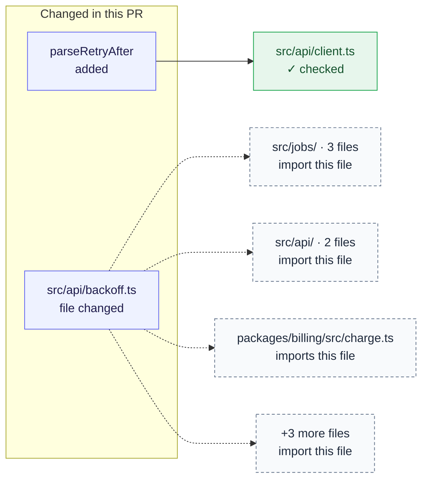

<!-- PR_REVIEWER_REPORT -->
### ✅ No issues found

Reworks the private jitter helper behind every retrying client and exports `parseRetryAfter`.

**Checked:** 3 of 3 changed files read · 1 of 1 dependent file traced · 3 possible issues → 0 confirmed → 0 posted

What this change reaches — 1 changed export · 1 dependent file · 1 checked · 1 changed file imported by 9 files

- `parseRetryAfter` (`src/api/headers.ts`) — added change · 1 consumer file · 1 verified unaffected
- `src/api/backoff.ts` — changed file · imported by 9 files, not traced

Review details

| Gate | Status | Details |
|---|---|---|
| Description vs. code | ✅ | The description matches what the diff does. |
| Prior review feedback | ✅ | Earlier review comments are resolved. |
| Documentation | ✅ | The change is documented well enough to follow. |
| Self-review signals | ✅ | No debug logs, leftover TODOs, or unreviewed stubs. |
| Code review | ✅ | The multi-lens review found no blocking issues. |

**Found**

Quality — produced 3 → posted inline 0 · cleared 0 · carried forward 0 · deferred 0 · below-bar 0

**Run**

full · 46 lines in delta · tier deep · depth checkout
Memories — 53 indexed · 0 used

Nothing to report — standards (2 docs), optimality (2 judged), measurability (3 paths classified), integrations (not activated), severity, 0 files skipped.

`pr-reviewer` · commit `4e7a91c` · full review · [how these findings are produced](https://github.com/mthines/agent-skills/blob/main/agents/pr-reviewer.md) · updated <relative-time datetime="2026-10-03T21:40:00.000Z">Oct 3, 2026 9:40pm UTC</relative-time>
