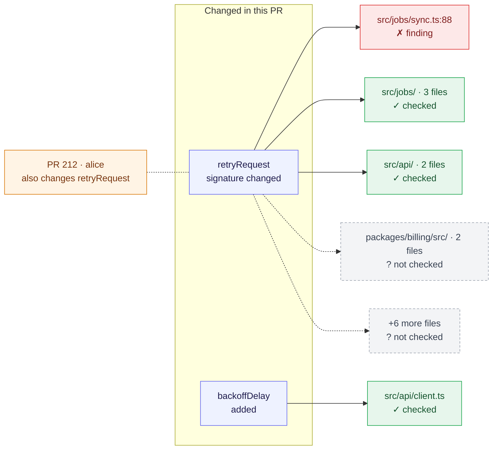

<!-- PR_REVIEWER_REPORT -->
### 🟡 1 finding

Makes `retryRequest` throw on exhaustion and moves the backoff policy into one module.

**Warnings:** 1 open review thread; 1 non-blocking finding

**Checked:** 22 of 22 changed files read · 7 of 15 dependent files traced · 11 possible issues → 2 confirmed → 1 posted

**Progress:** open review threads 5 → 3 → 2 · blocking 2 → 1 → 0 across the last 3 reviews

| Finding | Where | Severity |
|---|---|---|
| `sync.ts` still branches on the old null contract | [`src/jobs/sync.ts:88`](https://github.com/o/r/pull/7#discussion_r71) | 🟡 medium |

What this change reaches — 2 changed exports · 15 dependent files · 7 checked · 1 flagged · 8 not checked · 1 open-PR overlap

- `retryRequest` (`src/api/client.ts`) — signature change · 14 consumer files · 5 verified unaffected · 1 finding inline · 8 not traced
- `backoffDelay` (`src/api/backoff.ts`) — added change · 1 consumer file · 1 verified unaffected
- `retryRequest` is also changed on [#212](https://github.com/o/r/pull/212) by `alice` — a semantic conflict is likely even if git merges both cleanly

1 more findings — verified, too minor to comment on

- `src/api/backoff.ts:12` — suggestion: name the 250 ms base delay so the two clients share it. (confidence 83)

Review details — 1 open review thread

**Needs attention**

| Gate | Status | Details |
|---|---|---|
| Description vs. code | ✅ | The description matches what the diff does. |
| Prior review feedback | ⚠️ | 1 unresolved review thread(s) — see the thread list below |
| Documentation | ✅ | The change is documented well enough to follow. |
| Self-review signals | ✅ | No debug logs, leftover TODOs, or unreviewed stubs. |
| Code review | ⚠️ | 1 non-blocking finding — see inline comments. |

**Open review threads (1)** 2 resolved since `8d2e4a1`

- [`src/api/backoff.ts:41`](https://github.com/o/r/pull/7#discussion_r52) — jitter is still seeded once per process (bot · `cursor`)

**Found**

Quality — produced 11 → posted inline 1 · cleared 2 · carried forward 0 · deferred 1 · below-bar 0
Severity — 🟡 1 medium

**Run**

full · 164 lines in delta · tier deep · depth checkout · thoroughness 0.95
Memories — 31 indexed · 0 used

Nothing to report — standards (1 doc), optimality (2 judged), measurability (2 paths classified), integrations (not activated), 0 files skipped.

`pr-reviewer` · commit `9b1f0c2` · full review · [how these findings are produced](https://github.com/mthines/agent-skills/blob/main/agents/pr-reviewer.md) · updated <relative-time datetime="2026-09-30T10:05:00.000Z">Sep 30, 2026 10:05am UTC</relative-time>
